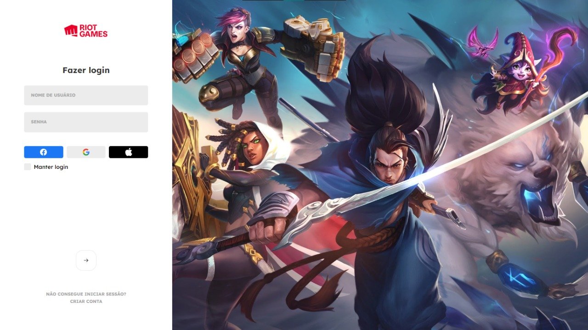

<h1 align="center">🎮 LoginScreenLOL 🎮</h1>

 

 

 
Clique na Imagem para Acessar o <strong>LoginScreenLOL</strong>!  Site que simula a tela de login do jogo   <strong>League of Legends</strong> da <strong>Riot Games</strong>

---

 
## O que é o projeto LoginScreenLOL e qual é o seu objetivo?

O projeto **LoginScreenLOL** é uma aplicação web desenvolvida por **João Alfredo Alves** com o objetivo de por em prática as funcionalidades e integrações do **JavaScript** com o **HTML** e **CSS** ao desenvolver uma Aplicação Web Responsiva.

---

## Linguagens e Tecnologias Usadas

- HTML 5
- CSS 3
- JavaScript

---
 
## Por que o projeto é útil?

O projeto **LoginScreenLOL** é útil para o treino e aprendizado das práticas de Funções e outros conceitos JavaScript ao desenvolver uma aplicação que tem uma interface com o usuário (por meio de browser), com funcionalidades que utilizam HTML5 e CSS3 com boas práticas de programação.
 

